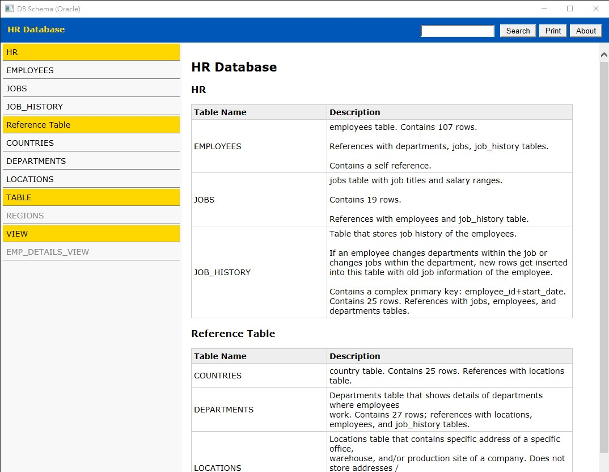
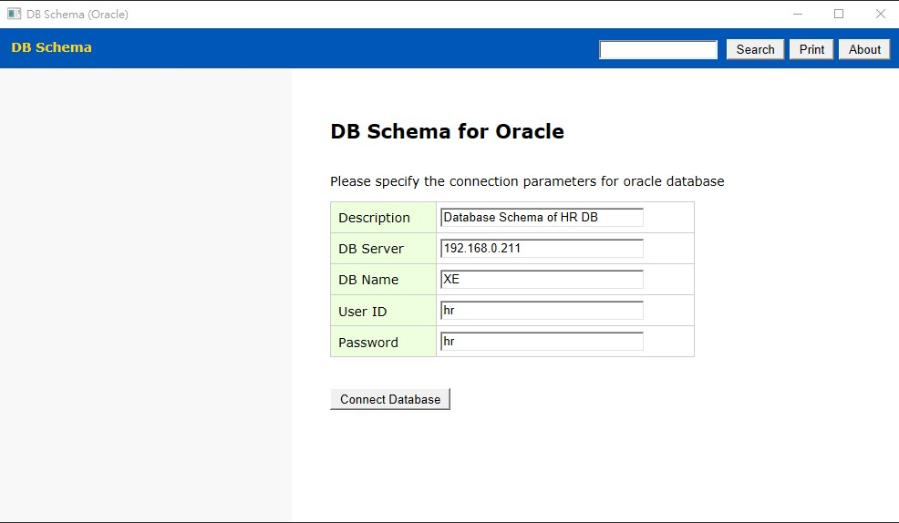

# hta-db-schema

Document DB Schema for Oracle (using hta script)

This is a simple hta script to show/document oracle tables/views. it use OLEDB (driver=MSDAORA) to connect to oracle. no more dependance.

## Features

1. single hta scripting file
2. no dependance without any css/js lib
3. document oracle oralce built-in "comments" feature.
4. classify tables/views into "folder"
4. show/edit/print table summary (for classified table/view only)
5. show/edit/print table definition 

## Usage Guide

just download file [db-schema-oracle.hta](srouce\db-schema-oracle.hta) to local, and click to run.

1. input the oracle database connection parametes, and click "connect" button
1. by default, tables/views will show in folder of "TABLE/VIEW" in grey color
1. click on folder to toggle table list
1. click on table to show table definition
1. DoubleClick on table description to edit (and setup folder)
1. DoubleClick on column description to edit
1. Click "print" button to print table definition
1. input keyword and press enter (or click on "search" button) to search name+comments

you may edit below script (bottom of file, line 262) to setup the default DB connection.

~~~
  //===== initial db connection parameters =====
  app('dbtitle').value = 'Database Schema of HR DB'
  app('dbserver').value = '192.168.0.211'
  app('dbname').value = 'XE'
  app('dbuser').value = 'hr'
  app('dbpass').value = 'password'
  //app.connectdb()
  //===== end of db parameters ====================
~~~  

## Modification Log

* 2022/07/06, v0.70, initial version
